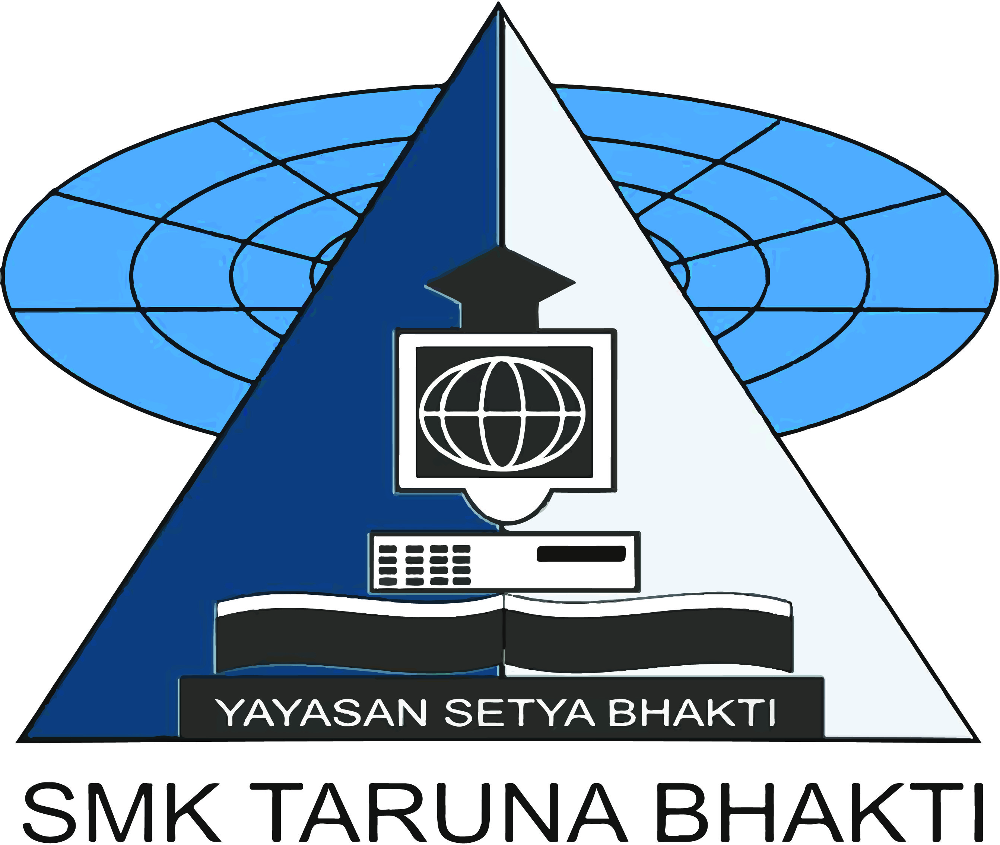
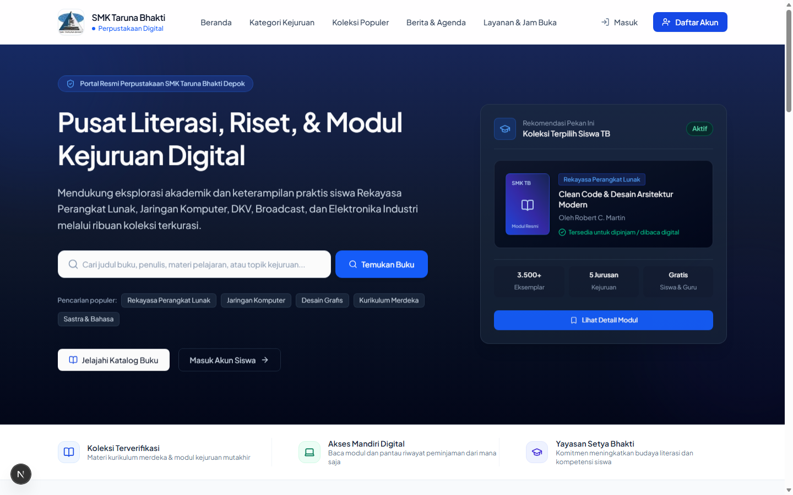
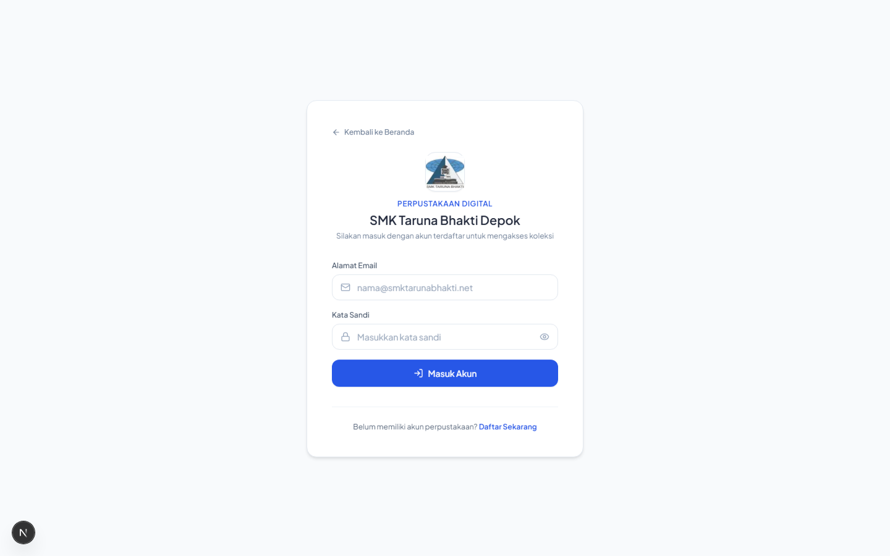

# Perpustakaan Digital SMK Taruna Bhakti Depok

<p align="center">
  
</p>

<p align="center">
  <strong>Yayasan Setya Bhakti &bull; SMK Taruna Bhakti Depok</strong><br />
  Pusat Sumber Belajar, Riset, & Modul Kejuruan Digital
</p>

---

## Pratinjau Tampilan Web (Redesign Baru)

### 1. Halaman Beranda (Desktop View)


### 2. Halaman Masuk Akun Siswa & Guru


---

## Deskripsi Sistem

**Perpustakaan Digital SMK Taruna Bhakti Depok** adalah sistem manajemen perpustakaan modern yang dirancang untuk mendukung ekosistem literasi dan pembelajaran siswa di lingkungan SMK Taruna Bhakti. Sistem ini mengintegrasikan katalog buku pelajaran Kurikulum Merdeka nasional serta modul praktik spesifik program keahlian.

### Fitur Unggulan

1. **Desain Modern & Profesional (Tanpa AI-Slop & Tanpa Emote)**:
   - Menggunakan palet institusional *Deep Maritime Navy* dan *Slate Neutrals*.
   - Tipografi elegan **Plus Jakarta Sans** dengan hierarki seimbang (bebas dari teks over-bold/chunky).
   - Ikonografi vektor tajam berbasis **Lucide Icons** menggantikan semua emotikon.
   - Animasi transisi masuk halus (*smooth entrance keyframes* & micro-interactions).

2. **Kategori Berdasarkan 5 Program Kejuruan SMK Taruna Bhakti**:
   - **RPL (Rekayasa Perangkat Lunak)**: Web, mobile, cloud computing, database, dan arsitektur kode.
   - **TKJ (Teknik Komputer & Jaringan)**: Administrasi server Linux, Mikrotik/Cisco, keamanan jaringan.
   - **DKV (Desain Komunikasi Visual)**: UI/UX, ilustrasi digital, tipografi, dan motion graphics.
   - **BC (Broadcasting & Perfilman)**: Produksi siaran, tata kamera, tata suara, dan video editing.
   - **TEI (Teknik Elektronika Industri)**: Otomasi industri, sensor IoT, mikrokontroler, robotika.
   - **Kurikulum Merdeka**: Buku teks nasional Fase E (Kelas X) dan Fase F (Kelas XI–XII).

3. **Pencarian Cepat & Filter Instan**:
   - Pencarian real-time berdasarkan judul buku, topik kejuruan, atau nama penulis.
   - Tag pencarian cepat untuk topik yang paling sering dicari siswa.

4. **Portal Multi-Role (Siswa, Guru, Petugas, & Admin)**:
   - Manajemen peminjaman dan pengembalian mandiri.
   - Verifikasi jadwal pengambilan buku fisik dan pembacaan format e-book digital.

---

## Panduan Instalasi & Menjalankan Lokal

### 1. Kebutuhan Sistem
- **Node.js**: v18.x atau lebih baru
- **NPM**: v9.x atau lebih baru
- **MySQL / MariaDB**: (misal via Laragon atau XAMPP)

### 2. Langkah Instalasi
```bash
# Clone repositori
git clone https://github.com/BintangPPLG/perpustakaan-taruna-bhakti.git

# Masuk ke direktori
cd perpustakaan-taruna-bhakti

# Pasang dependensi
npm install

# Impor database
# Impor file database.sql ke MySQL / phpMyAdmin Anda (database: perpustakaan_tb)

# Jalankan server pengembangan
npm run dev
```

Buka peramban di [http://localhost:3000](http://localhost:3000).

---

## Struktur Direktori Utama

```
perpustakaan-taruna-bhakti/
├── app/
│   ├── api/                    # Endpoint API backend (Auth, User, Peminjaman)
│   ├── components/             # Komponen UI (Navbar, UserNavbar, BookCarousel, dll)
│   ├── dashboard/              # Halaman Dashboard (User, Teacher/Petugas, Admin)
│   ├── login/                  # Halaman Autentikasi Masuk
│   ├── register/               # Halaman Registrasi Akun
│   ├── globals.css             # Desain Sistem & Keyframe Animasi Halus
│   ├── layout.tsx              # Root Layout dengan Font Plus Jakarta Sans
│   └── page.tsx                # Halaman Utama (Beranda Redesign)
├── public/                     # Aset statis & logo resmi Taruna Bhakti
├── screenshots/                # Dokumentasi gambar pratinjau web
├── database.sql                # Skema basis data MySQL
└── package.json                # Dependensi proyek
```

---

## Hak Cipta & Lembaga

&copy; 2026 **SMK Taruna Bhakti Depok &bull; Yayasan Setya Bhakti**.  
Alamat: Jl. Pekapuran RT 02/06 Kel. Curug, Kec. Cimanggis, Kota Depok, Jawa Barat 16953.  
Website: [smktarunabhakti.net](https://smktarunabhakti.net)
